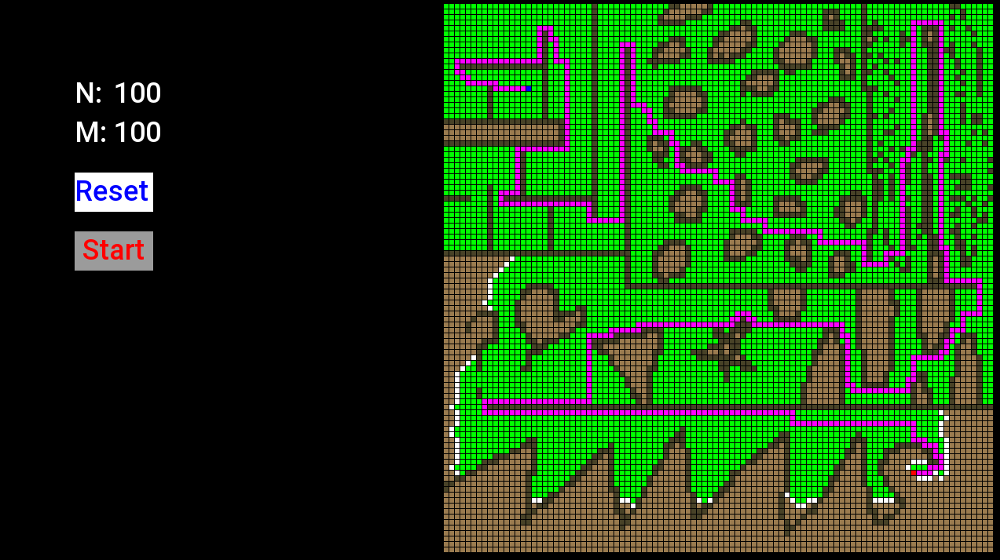
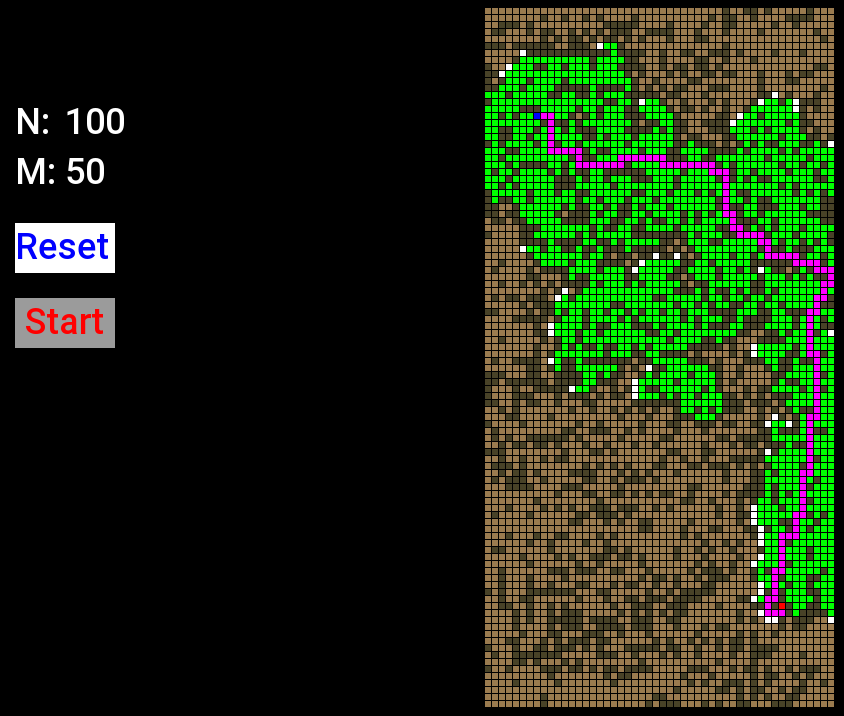
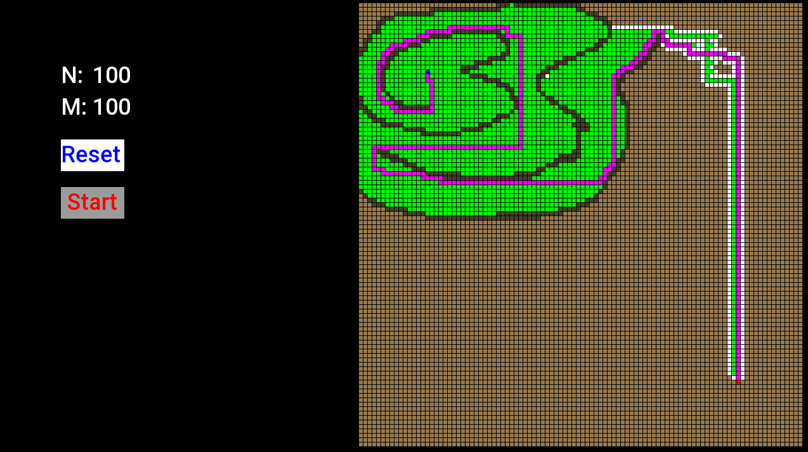
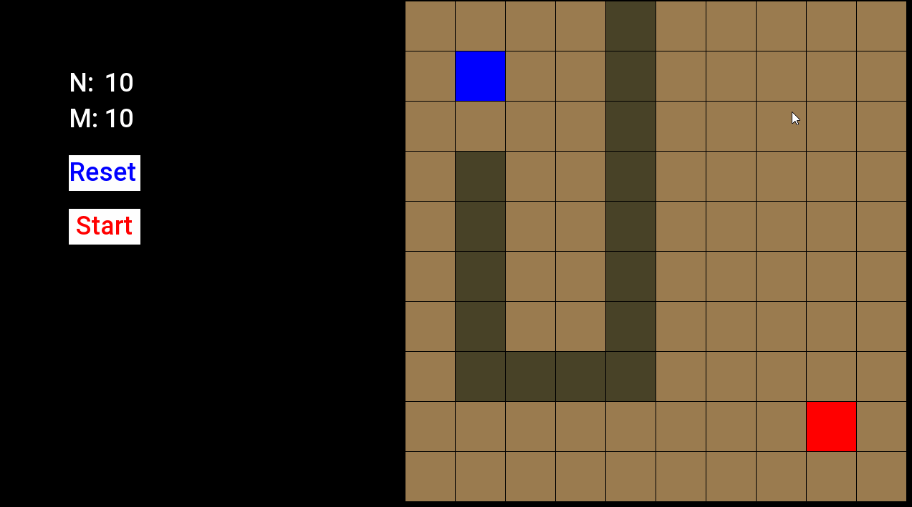

# A* Algorithm Visualization
## Description
This visualization project allows users to interactively create custom maps with arbitrary shapes and place obstacles to simulate various scenarios. By observing the A* algorithm in action, users can gain a better understanding of how it finds the optimal path in different situations.
## How to build
To build this project, you need the following:
* Visual Studio 2022
* C++20
* SFML Library [(Visual Studio SFML Setup Guideline)](https://www.sfml-dev.org/tutorials/2.6/start-vc.php) 

## How to play
1. Download the ```AStarVisualization.exe``` executable from the repository
2. Download the ```fonts``` folder and place it with the executable
3. Run the executable

* Mouse Left Click(or Hold) : place an obstacle at the cursor position
* Mouse Right Click(or Hold) : remove an obstacle at the cursor position
* N Field : The number of rows
* M Field : The number of columns
* Reset Button : Apply the numbers written in N and M fields and reset the map
* Start Button : Calculate a path from the source(blue block) to the destination(red block)

## Images







